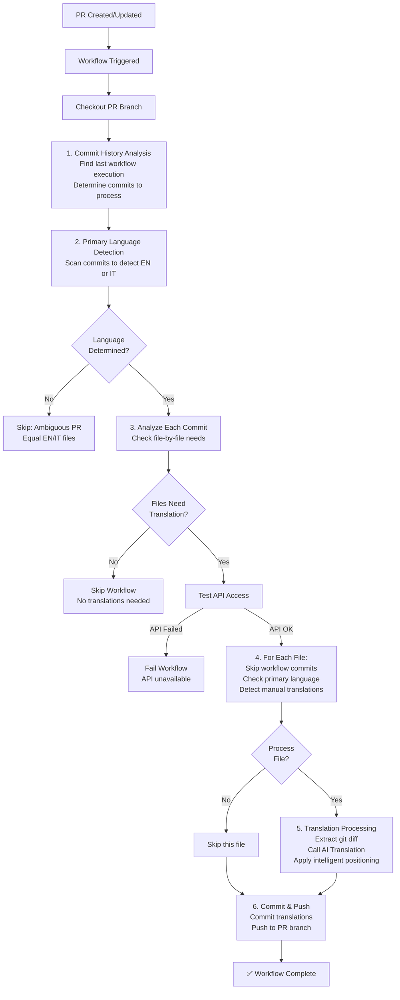

# Translation Sync System - Technical Architecture

## System Overview

The automated translation system consists of three main components working together to synchronize English and Italian documentation in the NethSecurity project.

## File Components

### 1. GitHub Workflow (`.github/workflows/sync-translations.yml`)

**Purpose**: Orchestrates the entire translation workflow
**Trigger Conditions**:
- Pull Request created or updated
- Target branch: `main`
- Modified files: `*.md` or `*.mdx` in documentation directories
- Repository: Internal PRs only (not forks)

**Workflow Steps**:
1. **Commit History Analysis**: Fetches all commits and finds the last successful workflow execution
2. **Primary Language Detection**: Determines if PR is primarily English or Italian changes
3. **Translation Decision**: Analyzes each file to decide if automatic translation is needed
4. **API Testing**: Verifies GitHub Models API access (fail-fast approach)  
5. **Translation Processing**: Calls Python agent for each file requiring translation
6. **Git Operations**: Commits and pushes translations to PR branch

**Key Features**:
- Conditional execution (only runs when translation is needed)
- Smart history tracking via GitHub API to avoid re-processing commits
- Primary language detection from PR commits
- Manual translation detection (skips if both EN and IT modified together)
- Fail-fast API testing to prevent partial execution
- Conventional Commits compliance
- Automatic branch management
- Filtering of workflow-generated commits to prevent loops

### 2. Translation Sync Agent (`.github/scripts/translation-agent/translation-sync-agent.py`)

**Purpose**: Core translation logic and file processing
**Main Class**: `DocumentationSyncAgent`

**Key Methods**:
- `get_file_diff()`: Extracts git diff for specific files
- `map_en_to_it_path()` / `map_it_to_en_path()`: Bidirectional path mapping
- `analyze_changes_with_ai()`: AI-powered translation using GitHub Models
- `apply_translation_to_file()`: Applies translations to target files
- `sync_translation()`: Orchestrates the translation process

**Translation Features**:
- Git diff analysis to identify only new/modified content
- Structured AI prompts with formatting rules
- Markdown preservation (links, IDs, code blocks)
- Intelligent title translation with examples
- Technical terminology consistency

**AI Integration**:
- **Model**: `openai/gpt-4o` via GitHub Models API
- **Authentication**: GitHub token with Copilot access
- **Prompt Engineering**: Structured instructions for consistent output
- **Error Handling**: Graceful degradation and retry logic

### 3. API Testing Script (`.github/scripts/translation-agent/test-copilot-access.py`)

**Purpose**: Validates GitHub Models API connectivity before processing
**Function**: Performs a lightweight API test to ensure translation capability

**Test Process**:
- Attempts connection to GitHub Models endpoint
- Validates authentication and model access
- Returns success/failure status for workflow decision
- Prevents unnecessary file processing if API is unavailable

**Integration**: Called by workflow before translation agent execution

## Path Mapping System

**Mapping Logic**:
```
English: docs/tutorial/example.md
Italian: i18n/it/docusaurus-plugin-content-docs/current/tutorial/example.md
```

**Directory Structure**:
```
English Documentation (docs/):
├── tutorial/
├── administrator-manual/
├── user-manual/
└── intro.md

Italian Documentation (i18n/it/docusaurus-plugin-content-docs/current/):
├── tutorial/
├── administrator-manual/
├── user-manual/
└── intro.md
```

## Workflow Execution Flow



## Commit History and Processing

### History Analysis System
The workflow implements an intelligent commit tracking system to avoid re-processing already translated content:

**Process**:
1. **Fetches all commits** in the PR using `git merge-base origin/main..HEAD`
2. **Queries GitHub API** to find the last successful workflow execution on the branch
3. **Calculates commit range**:
   - If first run: processes all commits from PR start (`$MERGE_BASE..HEAD`)
   - If previous runs exist: processes only new commits after last execution (`$LAST_WORKFLOW_COMMIT..HEAD`)
4. **Iterates through commits** to be processed, analyzing each one individually

**API Call**:
```
GET /repos/{owner}/{repo}/actions/workflows/sync-translations.yml/runs
  ?branch={branch_name}&per_page=5
```

Extracts the `head_commit.id` from the most recent completed run.

### Primary Language Detection
The workflow determines the PR's primary language by analyzing commits:

**Detection Algorithm**:
1. Scans commits **in reverse order** (oldest to newest)
2. For each commit, categorizes files as:
   - **EN**: Files in `docs/` directory
   - **IT**: Files in `i18n/it/docusaurus-plugin-content-docs/current/`
3. **Determines language** based on first meaningful commit:
   - **Only EN files** → Primary language = **English**
   - **Only IT files** → Primary language = **Italian**
   - **Mixed files** → Count and use majority (EN > IT → English, etc.)
   - **Equal count** → Continue to next commit
4. **Stops when** language is determined or all commits are scanned

**Result**: If language cannot be determined (all commits have equal EN/IT files), workflow skips (no ambiguity)

### Commit Filtering and File Analysis
For each commit in the processing range:

**Filters**:
- **Skips workflow-generated commits**: If commit message contains "auto-sync translations"
- **Prevents loops**: Avoids re-processing translations created by previous workflow runs

**File-by-File Decision**:
For each file modified in a commit:
1. **Checks language match**: File language must match PR's primary language
   - English file in English-primary PR → candidate for translation
   - Italian file in Italian-primary PR → candidate for translation
   - Opposite language → skipped
2. **Detects manual translations**: 
   - If **both** English AND Italian counterpart files are modified in the **same commit**
   - Assumes developer manually translated content
   - **Skips automatic translation** for that commit pair
3. **Marks for translation**: If only one file is modified (not both), marks for automatic translation

## Translation Rules Implementation

### AI Prompt Structure

The agent uses a **dual-persona prompt system** with specialized AI agents:

**Persona 1: Translation Agent**
- **Role**: Expert technical documentation translator
- **Domain**: Network security and firewall systems
- **Temperature**: 0.2 (consistent, reproducible translations)
- **Task**: Translate git diffs from source to target language
- **Input**: 
  - Source language and target language
  - Git diff showing only new/modified content
  - File path and context
- **Output**: Translated markdown content only (no explanations)

**Persona 2: Positioning Agent**
- **Role**: Expert documentation editor
- **Specialty**: Intelligent content positioning and file merging
- **Temperature**: 0 (deterministic output)
- **Task**: Intelligently position translated content in target file
- **Input**:
  - Current target file content
  - New translated content
  - Original source content
  - Git diff context
- **Output**: Complete updated target file with translations properly merged

**Shared Formatting Rules**:
The agent uses carefully crafted prompts with specific rules:

```python
CRITICAL FORMATTING RULES:
- NEVER include markdown code blocks markers like ```markdown or ``` in the output
- Translate section titles when appropriate
- Do NOT translate common technical terms (API, Login, Feedback, Dashboard)
- When translating titles, DO NOT TRANSLATE the heading ID
  Example: '## Section Title {#section-id}' → '## Titolo Sezione {#section-id}'
- Keep email links: [email@domain.com](mailto:email@domain.com)
- Keep internal links: [text](relative/path.md)
- Bold for UI elements: **Install**, **Configure**
- Backticks for code/values: `Nethesis,1234`
```

### Title Translation Examples
Implemented in the agent's prompt:
- "Test section" → "Sezione di test"
- "Configuration" → "Configurazione"
- "API" → "API" (no translation)
- "Dashboard" → "Dashboard" (no translation)

### Content Preservation
- **Section IDs**: `{#section-id}` maintained exactly
- **Links**: Internal `[text](path.md)` and external links preserved
- **Code blocks**: Syntax and content unchanged
- **Email addresses**: Format preserved `[email](mailto:email)`
- **UI elements**: Bold formatting maintained `**Install**`

## Technical Implementation Details

### Git Operations
- **Merge Base**: Calculates `git merge-base origin/main..HEAD` to identify PR start
- **Workflow History**: Queries GitHub API to find last successful workflow execution
- **Commit Range**: 
  - First run: processes all commits from PR start to HEAD (`$MERGE_BASE..HEAD`)
  - Subsequent runs: processes only new commits (`$LAST_WORKFLOW_COMMIT..HEAD`)
- **Commit Analysis**: Uses `git diff-tree --no-commit-id --name-only -r $commit` per file detection
- **File Detection**: Processes `.md` and `.mdx` files only
- **Branch Management**: Works directly on PR branch
- **Commit Strategy**: Single conventional commit per PR with all translations
- **Commit Filtering**: Skips commits with "auto-sync translations" in message to prevent loops

### AI Integration Specifics
- **Endpoint**: `https://models.github.ai/inference/chat/completions`
- **Model**: `openai/gpt-4o` 
- **Temperature Settings**:
  - Translation: 0.2 (for consistent, reproducible translations)
  - Content Positioning: 0 (for deterministic output)
- **Request Timeout**: 60 seconds per request
- **Authentication**: GitHub token with Copilot subscription
- **Rate Limiting**: Exponential backoff retry logic
  - Max retries: 5 attempts
  - Base delay: 2 seconds
  - Backoff formula: `2 ** attempt_number`
  - Respects `Retry-After` header if provided
- **Intelligent Positioning**: Uses AI to determine optimal placement of translated content in target file

### Error Handling Strategy
1. **API Failures**: Fail-fast with clear error messages
2. **File Not Found**: Skip with warning, continue processing
3. **Translation Errors**: Log error, continue with remaining files
4. **Git Errors**: Stop execution, preserve repository state

## Security and Permissions

### GitHub Actions Permissions
```yaml
permissions:
  contents: write          # For committing translations
  pull-requests: write     # For PR operations  
  actions: read           # For workflow context
```

### API Security
- Uses organization's GitHub Copilot subscription
- No additional secrets required
- All operations within GitHub ecosystem
- Full audit trail in workflow logs

## Performance Considerations

### Optimization Features
- **Conditional Execution**: Only runs when translation needed
- **File-by-File Processing**: Prevents memory issues with large PRs
- **API Fail-Fast**: Avoids processing without translation capability
- **Single Commit**: Reduces git operations

### Resource Usage
- **CPU**: Minimal (mainly I/O operations)
- **Memory**: Low footprint per file
- **API Calls**: One per changed file
- **Execution Time**: ~30 seconds per file

## Monitoring and Debugging

### Workflow Logs Structure
The workflow provides detailed logging at each stage:

```
🔍 Debug: Branch information:
Target branch: main
Source branch: feature-branch
📍 Merge base: abc123def456

🔎 Checking for previous workflow executions...
✅ Found last workflow execution at commit: abc123def456
📝 Commits to process:
  - abc1111 feat: add new section
  - def2222 docs: update content
  
🔍 Determining PR primary language from all PR commits...
  ✓ Checking commit 1: feat: add new section
    ✅ Only EN files found
📌 PR primary language: English (EN)

🔄 Processing commits one by one...
━━━━━━━━━━━━━━━━━━━━━━━━━━━━━━
� Processing commit: feat: add new section
  📄 Files in commit:
    - docs/tutorial/example.md
  🤖 Analyzing files for translation needs...
    🔄 Need translation (EN → IT): docs/tutorial/example.md → i18n/it/.../example.md

🤖 Running translation agent for commits...
📦 Commit: feat: add new section
📝 File: docs/tutorial/example.md
✅ Translation completed

📝 Files with translation changes:
M i18n/it/docusaurus-plugin-content-docs/current/tutorial/example.md
✅ Translation changes committed and pushed (1 files)
```

### Debug Information Available
The workflow logs include:

**Phase 1: History Analysis**
- Branch information and merge base
- GitHub API query results
- Last workflow execution commit
- Commits to process range

**Phase 2: Language Detection**
- Each commit being analyzed
- File categorization (EN vs IT)
- Language determination progress
- Final primary language result

**Phase 3: File Analysis**
- Each file being processed
- Translation need determination
- Manual translation detection
- File-by-file results

**Phase 4: Translation Processing**
- Git diff extraction
- AI translation progress
- File positioning results
- API status and errors

**Phase 5: Commit**
- Changed files list
- Commit count
- Push confirmation

### Troubleshooting with Logs
When issues occur, the logs clearly indicate:
- Which commit failed and why
- Which file caused the problem
- What API errors occurred
- Whether it was a rate limit or timeout
- Retry attempts and delays

## Current System Limitations

### Design Constraints
1. **Language Detection**:
   - Requires clear majority or exclusive language in early commits
   - Cannot handle PRs with truly mixed EN/IT changes across entire history
   - Falls back to skip if unable to determine language

2. **Content Handling**:
   - Optimized for git diff-based incremental translations
   - AI-powered intelligent positioning is effective for most cases
   - May struggle with very large content modifications or complex restructuring
   - No awareness of multi-file dependencies or cross-references

3. **Manual Translation Respect**:
   - Only detects manual translations when both files are in the same commit

### Quality Considerations
1. **Translation Quality**:
   - Depends entirely on GPT-4o model accuracy
   - Requires human review for critical content
   - No automatic quality validation or consistency checks
   - Terminology might need manual adjustment for domain-specific content

2. **Content Positioning**:
   - AI-powered positioning is intelligent but not guaranteed perfect
   - Works best with standard markdown structure
   - May need manual adjustment for complex nested sections

3. **File Dependencies**:
   - Doesn't handle related images or media files
   - No automatic sidebar (`sidebars.ts`) updates
   - No validation of internal link consistency
   - No detection of broken cross-references

### Scalability Notes
- **Processing Time**: ~30-60 seconds per file depending on size and content
- **API Rate Limiting**: Handled with retry logic, but large PRs may take longer
- **Memory**: Minimal per-file footprint, suitable for large documentation sets
- **File Count**: No hard limit, but very large PRs (100+ files) may take extended processing time