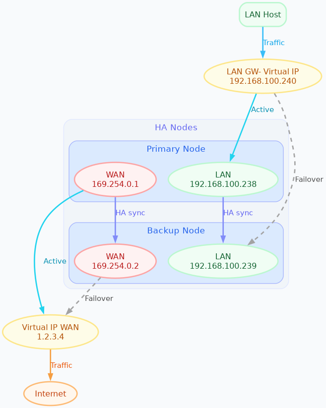

.. _ha_setup_and_management-section:

====================
Setup and management
====================

Requirements
============

Before setting up HA, ensure the following requirements are met:

- Two firewalls with identical network devices. Each device must have the exact same name and numbering (e.g., eth0, eth1, eth2, eth3)
- Both nodes must be connected to the same LAN; connect the LAN interfaces to the same broadcast domain (usually the same switch).
- Static IP addresses for all LAN interfaces that will host a virtual IP.

Setup and configuration
========================

The HA setup process involves several steps.
If you just want to see the commands, you can skip to the `Configuration example`_ section,
but it's recommended to read the entire section to understand the process and requirements.

The setup process is as follows:

1. **Install the same NethSecurity version** on two identical machines (physical or virtual).
   See :ref:`install-section` for detailed installation instructions.

2. **Connect network cables properly** to ensure redundancy.
   See `Network cabling`_ section below for proper cabling guidelines.

3. **Configure the HA interface** on both nodes with static IP addresses. Create a LAN on primary and secondary node 
   that will be needed for the cluster before proceeding with HA setup.
   See `HA interface`_ section below for detailed instructions.

4. **Initialize the cluster** using the `ns-ha-config` commands to establish the HA cluster foundation.
   The initialization process configures the necessary services and prepares both nodes for synchronization.
   During the first configuration, all network interfaces that will be used in the HA cluster must must have the cable connected on both nodes,
   otherwise the node may enter a fault state and the HA cluster will not work properly.
   See `Cluster initialization`_ section below for detailed instructions.

5. **Configure WAN interface in primary node** using the ``Interfaces and devices`` page in the web interface.
   WAN interfaces will be automatically configured inside the cluster and synchronized to the secondary node.
   See `WAN Interfaces`_ section below for more info.

6. **Verify the configuration** to ensure everything is set up correctly.
   Use the `ns-ha-config` commands to check the status and configuration of the HA cluster.
   See `Verify the configuration`_ section below for detailed instructions.

7. **Configure additional LAN interfaces (optional)** for the cluster.
   This step is optional and depends on your network setup. You can add any additional LAN interface that require HA support.
   See `Additional LAN interfaces`_ section below for detailed instructions.
   If you need to configure an hotspot, see `Hotspot support`_ section below for specific requirements.

8. **Add extra Virtual IPs (optional)** to the primary node on relevant LAN interfaces.
   This step is optional and allows you to add additional IP addresses to the primary node for services that require multiple IPs.
   See `Extra Virtual IPs`_ section below for detailed instructions.

The detailed steps for each of these points are covered in the sections below.

Sometimes, you may need to remove interfaces or aliases from the HA configuration.
This can be done using the ``ns-ha-config`` command.
See `Remove interfaces and virtual IPs`_ section below for detailed instructions.

Network cabling
---------------

Proper network cabling is essential to ensure high availability and seamless failover between the primary and secondary firewalls.

1. **General Recommendations**:

   - For each network zone (LAN, WAN, DMZ, etc.), use a dedicated switch or VLAN to connect both firewalls' interfaces.
   - Avoid connecting the firewalls directly to each other; always use a switch or network segment in between.
   - Label all cables and switches for clarity and easier troubleshooting.

2. **LAN Connections**:

   - Connect the LAN interfaces of both the primary and secondary nodes to the same network segment.
   - Ideally, use **two separate switches** for redundancy. Connect each firewall's LAN port to both switches (if supported), or at least ensure each firewall is 
     connected to a different switch. This avoids a single point of failure if one switch fails.
   - If using two separate switches for redundancy, they must be properly interconnected and support Spanning Tree Protocol (STP) to prevent network loops.
     Unmanaged switches without STP support may cause broadcast storms when interconnected.
   - If only one switch is available, use VLAN segmentation to logically separate each network zone and minimize broadcast domains.
   - Repeat this process for **each network interface** configured for HA (e.g., LAN, GUEST, DMZ). Each interface should be connected to its corresponding network segment, preferably through redundant switches.

3. **WAN Connections**:

   - Connect the WAN interfaces of both nodes to the ISP or upstream router.
   - For best redundancy, use the same approach as with the LAN connections.
   - If only one WAN switch/router is available, both firewalls should connect to it, but this introduces a single point of failure.
   - If your ISP provides a router with HA capability (e.g., VRRP or HSRP), you can connect both firewalls' WAN ports directly to the ISP's redundant routers.
   - Alternatively, you can configure MultiWAN directly in NethSecurity to manage multiple WAN uplinks and failover.

This setup ensures that if any single firewall or switch fails, network connectivity is maintained through the secondary node and the remaining switch.

The below diagram illustrates the recommended redundant network setup, switches are omitted for clarity.

Interfaces management
----------------------

Interfaces can be categorized as follows:

1. **HA interface**:

This is the interface used for VRRP communication.
It has to be configured on the primary and the secondary node, then it must be added to the HA configuration during initialization.
This interface requires three distinct IP addresses: one on the primary node, one on the secondary node and a VIP (Virtual IP) that moves between units when their roles change (Master/Backup). `HA interface`_ 

2. **Additional LAN interfaces**:

Any interface that is not a WAN, such as another LAN, a guest network, or a DMZ.
These are also managed using the three-address logic (primary IP, secondary IP, and VIP), they have to be configured on the primary and the secondary node, then they must be added to the HA configuration after initialization.
A fault on any of these interfaces triggers a failover between units.
They are configured by adding them as LAN interfaces. `Additional LAN interfaces`_

3. **WAN interfaces**:

These interfaces are treated as special cases. WANs may have limitations when using the three-address scheme (for example, when public IPs are assigned), and it is essential to prevent conflicts between HA mechanisms and MultiWAN management. 
For this reason, WAN interfaces do not trigger a failover, ensuring proper MultiWAN handling, especially in complex or high-value installations. 
WAN interfaces only need to be configured on the primary node; they are automatically replicated to the secondary node, further details are provided in the dedicated section below.

HA interface
------------

The HA cluster requires static IP addresses for all LAN interfaces that will host a virtual IP.
Follow these steps:

- Power on the secondary node, access the web interface and set a physical interface with a static LAN IP address (e.g., `192.168.100.239`).
- Power on the primary node, access the web interface and set a physical interface with a static LAN IP address (e.g., `192.168.100.238`).

These static IP addresses are used to access the nodes directly, even if the HA cluster is disabled. Consider them *management IP addresses*.

Cluster initialization
----------------------

The setup process configures `keepalived` for failover, `rsync` over SSH for configuration synchronization, and `conntrackd` to sync the connection tracking table.
All this data passes through the HA interface, which is the one configured during the initialization phase.
Use the ``ns-ha-config`` script to simplify the process.

Before diving into the actual setup, it's important to ensure that both nodes are properly configured and meet the necessary requirements.

Access the console or SSH into the primary node and run the following commands.

Check requirements
^^^^^^^^^^^^^^^^^^

For the primary node::

  ns-ha-config check-primary-node <lan_interface>

This checks:

- The HA interface exists and has a static IP.
- If DHCP server is running:

  - ``3: router`` DHCP option is set (should be the virtual IP).
  - ``6: DNS server`` DHCP option is set.

For the secondary node::

  ns-ha-config check-backup-node <backup_node_ip> <lan_interface>

This checks:

- The HA interface exists and has a static IP.
- Secondary node is reachable via SSH on port 22 with root user.

The script will request the root password for the secondary node. You can also pipe the password: ::

   echo "password" | ns-ha-config check-backup-node <backup_node_ip> <lan_interface>

Ensure the secondary node can be reached via SSH from the primary node on standard port 22.

Initialize nodes
^^^^^^^^^^^^^^^^

Initialize the primary node::

   ns-ha-config init-primary-node <primary_node_ip> <backup_node_ip> <virtual_ip_cidr> <lan_interface>

Where the ``primary_node_ip`` is the static IP of the primary node already set for the HA interface,
and ``backup_node_ip`` is the static LAN IP of the secondary node
The ``virtual_ip`` is the virtual IP address for the HA interface where all LAN hosts should point to, it must be specified in CIDR notation.

This script will:

- Initialize `keepalived` with the virtual IP for the LAN interface.
- Configure `conntrackd`.
- Generate a random password and public key for synchronization.
- Configure `dropbear` (SSH server) to listen on port `65022` and allow only key-based authentication for sync.

Initialize the secondary node, always execute the command on the primary node::

   ns-ha-config init-backup-node <lan_interface>

The script will ask for the root password of the secondary node. You can also pipe the password: ::

   echo '<password>' | ns-ha-config init-backup-node <lan_interface>

At this point, the nodes are configured to communicate over LAN, and the LAN virtual IP will failover.

WAN interfaces
--------------

The system does not require any special configuration for the WAN interfaces.
Just configure them inside the ``Interfaces and devices`` page on the primary node
and they will be automatically managed by the HA scripts.

WAN aliases can be added from the same network configuration page and will be automatically synchronized to
the secondary node.

WAN interfaces are brought up on the primary node and kept down on the secondary node.
Please note that the web interface on the secondary may not be consistent: it may show the interface as "up" even if it's down.
This is a known limitation and will be addressed in a future release.

Verify the configuration
------------------------

The cluster is now ready to be used. You can check the status of the cluster and verify that the configuration is correct.

Verify current configuration: ::

      ns-ha-config show-config

Check the status of the HA cluster. The first sync may take up to 5 minutes. ::

      ns-ha-config status

Initial status might show ``Last Sync Status: SSH Connection Failed``. After sync, it should show ``Last Sync Status: Up to Date``.

Additional LAN interfaces
-------------------------

It's possible to add additional LAN interfaces to the HA cluster after the initial setup.
Before adding an interface, ensure that the interface is configured with a static IP address on the primary node
and on the secondary node, much like the HA interface configured during the initial setup.
Interfaces can be ethernets, bridges, VLANs, or bonds, but make sure the secondary node has the same interface with the same name
and with the same device hierarchy (e.g., if the interface is a VLAN, the parent interface must also exist on the secondary node).

You can use this command to add any non-WAN interface, like a second LAN, DMZ or GUEST interface to the HA cluster.

Add additional interfaces as needed::

   ns-ha-config add-lan-interface <primary_node_ip> <backup_node_ip> <virtual_ip_address>

The following checks are performed:

- virtual IP address must be in CIDR notation (e.g., `192.168.100.1/24`)
- make sure a device with given static IP address exists on the node
- If DHCP server is running, the following

  - ``3: router`` DHCP option is set (should be the virtual IP).
  - ``6: DNS server`` DHCP option is set.

Example: ::

   ns-ha-config add-lan-interface 192.168.200.1 192.168.200.2 192.168.200.253/24

Hotspot support
---------------

The hotspot feature is supported in HA clusters, but there are important requirements:

- It must be configured on physical network interfaces only, VLAN interfaces are not supported.
- The secondary node must have the exact same network devices as the primary node. 
- To maintain hotspot functionality during failover, the MAC address of the interface running the hotspot on the primary node is automatically
  copied to the corresponding interface on the secondary node when a switchover occurs.
  This behavior prevents the use of VLAN interfaces for the hotspot.

Note that active sessions are stored in RAM and will be lost during a switchover; clients must re-authenticate unless auto-login is enabled.

Extra Virtual IPs
-----------------

A Virtual IP (VIP) is an additional IP address assigned to a network interface that
will be migrated to the secondary node in case of failover.
You can add Virtual IPs to the primary node on relevant interfaces.

This is useful for services that require multiple IP addresses on the same interface, such as virtual servers or load balancing.

Use the ``ns-ha-config`` command to register the virtual IP in the HA cluster configuration.

Virtual IPs must be explicitly set on the primary node. ::

   ns-ha-config add-vip <interface> <vip_ip_cidr>

**Note:** the virtual IP will appear as an extra IP address on the network interface inside the
``Interfaces and devices`` page of the web interface, but it will not be listed in the aliases section.

Remove interfaces and Virtual IPs
---------------------------------

Remove an interface from HA configuration: ::

   ns-ha-config remove-interface <interface>

Example: ::
   
   ns-ha-config remove-interface guest

This removes the interface from `keepalived`, so it will be excluded from the HA configuration.
Also, the virtual IP address associated with the interface will be moved to the network interface of the primary node.

Remove a virtual IP from HA configuration: ::

   ns-ha-config remove-vip <interface> <vip_ip_cidr>

Example: ::

   ns-ha-config remove-vip lan2 192.168.122.66/24

Configuration example
---------------------

Assuming:

- Primary Node LAN IP: `192.168.100.238`
- Secondary Node LAN IP: `192.168.100.239`
- LAN Virtual IP: `192.168.100.240/24`
- LAN Interface Name: `lan`
- Secondary Node Root Password: `backup_root_password`

Execute the following commands on the **primary node**:

1. Check requirements: ::

      # Check requirements first
      ns-ha-config check-primary-node lan
      echo "backup_root_password" | ns-ha-config check-backup-node 192.168.100.239 lan

2. Setup the cluster: ::

      # Initialize primary
      ns-ha-config init-primary-node 192.168.100.238 192.168.100.239 192.168.100.240/24 lan

      # Initialize secondary (run from primary node)
      echo "backup_root_password" | ns-ha-config init-backup-node lan
